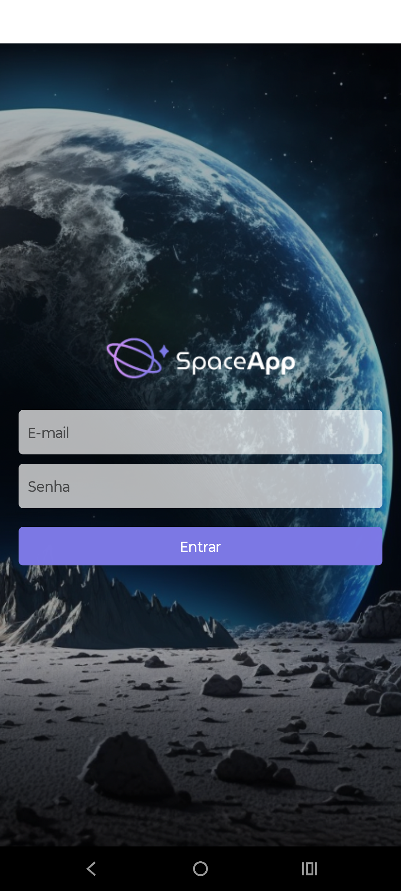
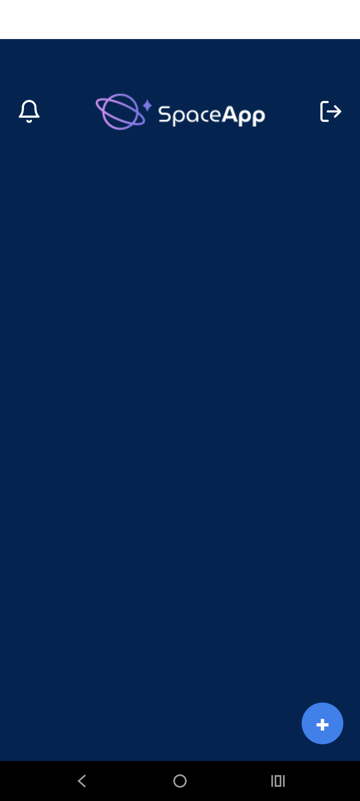
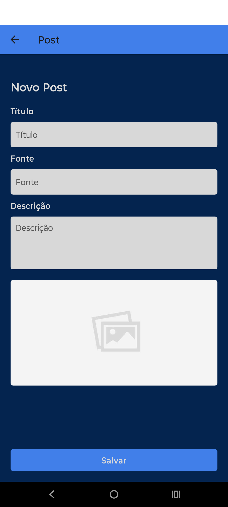

# React Native App: Instagram-like Posts with Firebase Integration

This React Native app, developed during an Alura course, offers a feature-rich experience for creating and browsing posts, complete with Firebase integration for authentication, notifications, and data storage.

## Features

### Login Screen

- **Secure Authentication:** Powered by Firebase Authentication for reliable user access.

### Main Screen

- **Immersive Scrolling:** Browse posts seamlessly, similar to an Instagram feed.
- **Post Creation:**
  - **Capture Photos:** Take pictures directly using the device's camera.
  - **Select from Storage:** Choose images from the device's gallery.
  - **Add Comments:** Interact with posts by leaving comments.

### Firebase Integration

- **Authentication:** Manage secure user logins.
- **Cloud Firestore:** Store and retrieve post images and comments.
- **Cloud Messaging:** Receive real-time notifications for new posts and comments.

## Screenshots

<table style="border-collapse: collapse;">
  <tr>
    <td align="center" style="padding: 10px;">
      
      <br>Login Screen
    </td>
    <td align="center" style="padding: 10px;">
      
      <br>Home Screen
    </td>
    <td align="center" style="padding: 10px;">
      
      <br>Post Creation
    </td>
  </tr>
</table>

## Getting Started

Follow these steps to set up and run the app:

1. **Clone the Repository:**

   ```bash
   gh repo clone StephaneAntonieto/rn-space-app
   ```

2. **Install Dependencies:**

   ```bash
   npm install
   ```

3. **Set Up Firebase:**

   - Create a Firebase project and obtain the configuration details.
   - Add these details to the `firebase/config.js` file.

4. **Run the App:**

   ```bash
   npx react-native run-android
   ```

## Additional Features

- **Authentication:** Secure user login with Firebase Authentication.
- **Post Creation:** Capture or select images, add comments, and create new posts.
- **Immersive Scrolling:** Smooth navigation through the post feed.
- **Notifications:** Real-time alerts for new posts and comments via Firebase Cloud Messaging.
- **Firestore Integration:** Efficiently store and retrieve post data (images and comments) using Cloud Firestore.

## Disclaimer

This project is intended for educational purposes and may require additional development for production-level deployment.
